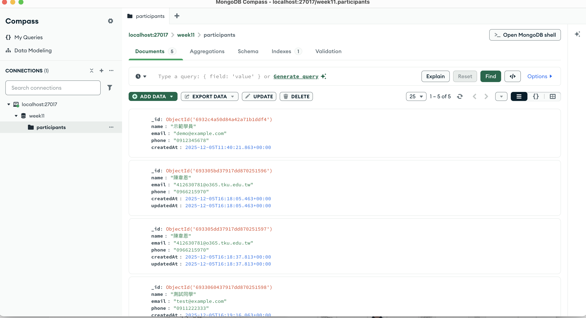

## 啟動指令
```shell
# 啟動 MongoDB（使用 Docker）
docker compose up -d
# 安裝套件
npm install
# 啟動伺服器（開發模式）
npm run dev
```
## 環境需求
- Node.js 18 以上
- MongoDB 6 以上（可使用 Docker）

## 測試方式
### 使用 Postman Client
- 建立報名：POST /api/signup
- 查詢清單：GET /api/signup?page=1&limit=10
- 更新資料：PATCH /api/signup/:id
- 刪除資料：DELETE /api/signup/:id

## 常見問題
1. 重複 Email 報名
- 已建立唯一索引，若重複會回傳錯誤訊息，避免資料重複。
2. 更新或刪除找不到資料
- 若指定 _id 不存在，API 會回傳 404。
3. 分頁失效或頁面為空
- 確認 page 與 limit 參數正確，並且資料庫中有對應筆數。
4. 連線 MongoDB 失敗
- 檢查 .env 中 URI、帳號、密碼設定是否正確。
- 確認 Docker 容器已啟動並運作正常。
  
## MongoDB Compass 資料結構截圖

下圖為 participants 集合內容：




| .env 欄位            | 用途                                                                |
| ------------- | ---------------------------------------------------------------------------------------------------------------------- |
| `MONGODB_URI` | MongoDB 連線字串，包括帳號、密碼、主機、連接資料庫及驗證資料庫。格式為 `mongodb://<username>:<password>@<host>:<port>/<database>?authSource=<authDB>` |
| `username`    | `week11-user`，登入 MongoDB 的使用者名稱                                                                                        |
| `password`    | `week11-pass`，登入 MongoDB 的密碼                                                                                           |
| `host`        | MongoDB 主機位置，這裡是 `localhost`                                                                                           |
| `port`        | MongoDB 連線埠號，預設 `27017`                                                                                                |
| `database`    | 目標資料庫，這裡是 `week11`                                                                                                     |
| `authSource`  | 認證資料庫，一般填登入用的資料庫名稱，也就是 `week11`                                                                                        |